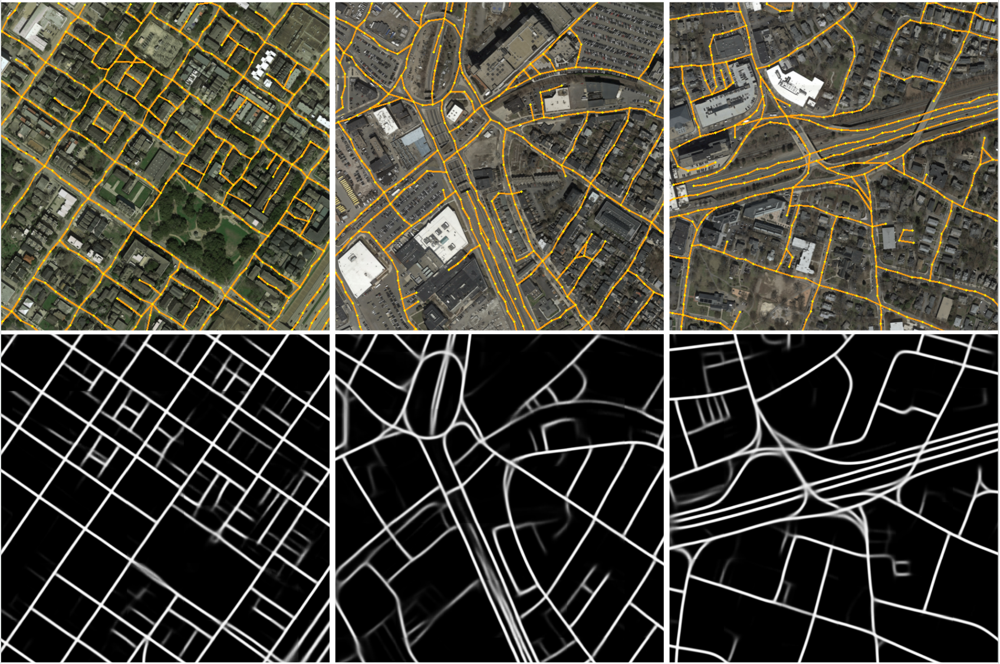

# Official codebase for "Segment Anything Model for Road Network Graph Extraction", CVPRW 2024
https://arxiv.org/pdf/2403.16051.pdf

[The paper](https://openaccess.thecvf.com/content/CVPR2024W/SG2RL/papers/Hetang_Segment_Anything_Model_for_Road_Network_Graph_Extraction_CVPRW_2024_paper.pdf) has been accepted by IEEE/CVF Computer Vision and Pattern Recognition Conference (CVPR) 2024, 2nd Workshop on Scene Graphs and Graph Representation Learning.

[Received the best paper award of the workshop](https://sites.google.com/corp/view/sg2rl/). Big thanks to the organizers for the recognition!!

## Demos
Predicted road network graph in a large region (2km x 2km).


Predicted road network graphs and corresponding masks in dense urban with complex and irregular structures.


## Installation
You need the following:
- an Nvidia GPU with latest CUDA and driver.
- the latest pytorch.
- pytorch lightning.
- wandb.
- Go, just for the APLS metric (we should really re-write this with pure python when time allows).
- and pip install whatever is missing.


## Getting Started

### SAM Preparation
Download the ViT-B checkpoint from the official SAM directory. Put it under:  
-sam_road  
--sam_ckpts  
---sam_vit_b_01ec64.pth  

### Data Preparation
Refer to the instructions in the RNGDet++ repo (https://github.com/TonyXuQAQ/RNGDetPlusPlus) to download City-scale and SpaceNet datasets.
Put them in the main directory, structure like:  
-sam_road  
--cityscale  
---20cities  
--spacenet  
---RGB_1.0_meter  

Download links copied from https://github.com/TonyXuQAQ/RNGDetPlusPlus
#### SpaceNet
https://drive.google.com/uc?id=1FiZVkEEEVir_iUJpEH5NQunrtlG0Ff1W

The data_split.json is copied from the dataset.json in this folder.

#### CityScale
https://drive.google.com/uc?id=1R8sI1RmFe3rUfWMQaOfsYlBDHpQxFH-H

Find the 20cities folder under this folder.

Then, run "python generate_labes.py" under both dirs.

### Training
City-scale dataset:  
python train.py --config=config/toponet_vitb_512_cityscale.yaml  

SpaceNet dataset:  
python train.py --config=config/toponet_vitb_256_spacenet.yaml  

You can find the checkpoints under lightning_logs dir.

### Inference
python inferencer.py --config=path_to_the_same_config_for_training --checkpoint=path_to_ckpt  
This saves the inference results and visualizations.

Inferencing with our checkpoints:

Cityscale:

python inferencer.py --config=config/toponet_vitb_512_cityscale.yaml --checkpoint=/path_to/cityscale_vitb_512_e10.ckpt

Spacenet:

python inferencer.py --config=config/toponet_vitb_256_spacenet.yaml --checkpoint=/path_to/spacenet_vitb_256_e10.ckpt

### Test
Go to cityscale_metrics or spacenet_metrics, and run  
bash eval_schedule.bash  

Check that script for details. It runs both APLS and TOPO and stores scores to your output dir.

## Our Checkpoints
[congrui/sam_road](https://huggingface.co/congrui/sam_road)

## Citation
```
@article{hetang2024segment,
  title={Segment Anything Model for Road Network Graph Extraction},
  author={Hetang, Congrui and Xue, Haoru and Le, Cindy and Yue, Tianwei and Wang, Wenping and He, Yihui},
  journal={arXiv preprint arXiv:2403.16051},
  year={2024}
}
```

## Acknowledgement
We sincerely appreciate the authors of the following codebases which made this project possible:
- Segment Anything Model  
- RNGDet++  
- SAMed  
- Detectron2  

## TODO List
- [x] Basic instructions
- [x] Organize configs
- [x] Add dependency list
- [x] Add demos
- [x] Add trained checkpoints


